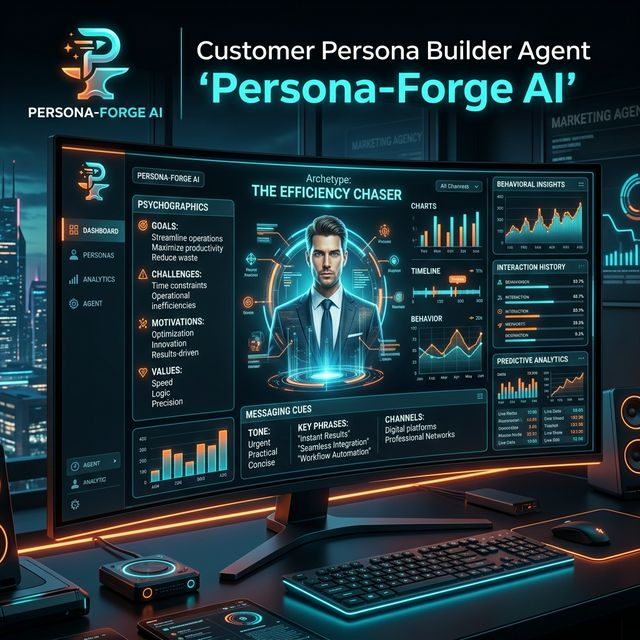

# 🛡️ Persona-Forge AI (Customer Persona Builder)

Transform raw market data, product insights, and customer challenges into deep, actionable, and psychologically-grounded customer personas.



## 🚀 Overview
**Persona-Forge AI v2.0** is an advanced customer research and synthesis engine. Unlike traditional persona builders that rely on surface-level demographics, Persona-Forge uses multi-model neural intelligence to infer cognitive biases, internal motivations, and actionable messaging hooks.

## ⚡ Key Features
- **Deep Psychology Synthesis**: Infers "Decision Fatigue" and "Fears" from raw operational challenges.
- **Archetype Mapping**: Automatically assigns personas to proven market archetypes (e.g., The Efficiency Chaser).
- **Messaging Strategy**: Generates power words, trust signals, and high-conversion hooks for every persona.
- **Multi-Model Support**: Powered by LiteLLM – switch between GPT-4o, Claude 3.5, Gemini 1.5, and Llama 3 instantly.
- **Premium Analytics UI**: A sleek Streamlit dashboard for interactive persona generation and refinement.

## 🛠️ Tech Stack
- **Frontend**: Streamlit (Glassmorphism UI)
- **Intelligence**: LiteLLM (GPT-4o, Gemini, Claude)
- **Data Export**: JSON, Structured TXT

## 📂 Structure
- `agent.py`: The core NLP engine and CLI implementation.
- `app.py`: The premium Streamlit dashboard.
- `input.txt`: Default market context for batch processing.
- `requirements.txt`: Project dependencies.

## 🚀 Quick Launch

### 1. CLI Usage
```bash
python agent.py
```

### 2. Dashboard Usage
```bash
streamlit run app.py
```

## 📊 Sample Output Schema
```json
{
  "persona_name": "Oliver the Optimizer",
  "archetype": "The Efficiency Chaser",
  "core_motivations": ["Operational consistency", "Cost-to-impact ratio"],
  "messaging_strategy": {
    "hooks": ["Stop the manual bleed", "Automate or Atrophy"],
    "power_words": ["Frictionless", "Validated", "Autopilot"]
  }
}
```

---
*Part of the [Real-world-AI-agents-hub](https://github.com/HarshChoudhary2003/Real-world-AI-agents-hub)*
