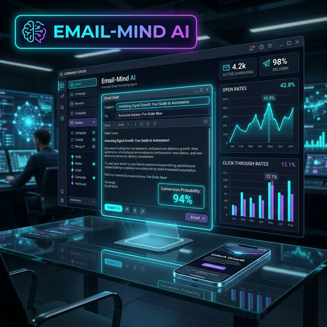

# 📩 Email-Mind AI (Email Marketing Agent)

Generate high-conversion, psychologically-optimized email marketing campaigns with real-time mobile previews and multi-model intelligence.



## 🚀 Overview
**Email-Mind AI v3.0** is a professional-grade copywriting agent designed to architect engagement strategies. It leverages industry-standard frameworks like AIDA (Attention, Interest, Desire, Action) and PAS (Problem, Agitation, Solution) to craft emails that resonance with your target audience and drive measurable results.

## ⚡ Key Features
- **Inbox Preview (Mobile/Desktop)**: Visualizes exactly how your subject line and body copy will appear to customers in real-time.
- **Psychological Trigger Mapping**: Automatically identifies and leverages specific triggers such as Scarcity, Curiosity, and Social Proof.
- **Provider-First Selection**: Choose your preferred "Brain" from a list including OpenAI, Gemini, Claude, DeepSeek, or Groq.
- **Framework-Driven Copy**: Select from proven strategic frameworks to ensure your message is structured for maximum conversion.
- **Dynamic Subject Lines**: Generates multiple subject lines optimized for different psychological angles (Benefits vs. Curiosity).

## 🛠️ Tech Stack
- **Frontend**: Streamlit (Animated Glassmorphism UI)
- **Intelligence**: LiteLLM (Multi-model support)
- **Frameworks**: AIDA, PAS, BAB (Before-After-Bridge)
- **Data Formats**: JSON for campaign logic, TXT for draft export.

## 📂 Structure
- `agent.py`: Core copywriting engine and multi-provider CLI wrapper.
- `app.py`: Premium animated Streamlit dashboard.
- `input.txt`: Default campaign context for batch processing.
- `requirements.txt`: Project dependencies.

## 🚀 Quick Launch

### 1. CLI Usage
```bash
python agent.py
```

### 2. Dashboard Usage
```bash
streamlit run app.py
```

## 📊 Strategic Output
The agent outputs a structured JSON campaign brief including:
- **Subject Options**: Multi-angle subject lines.
- **Preview Snippets**: Optimized sub-header text for inbox visibility.
- **Strategic Breakdown**: The specific psychological triggers and frameworks leveraged.

---
*Part of the [Real-world-AI-agents-hub](https://github.com/HarshChoudhary2003/Real-world-AI-agents-hub)*
