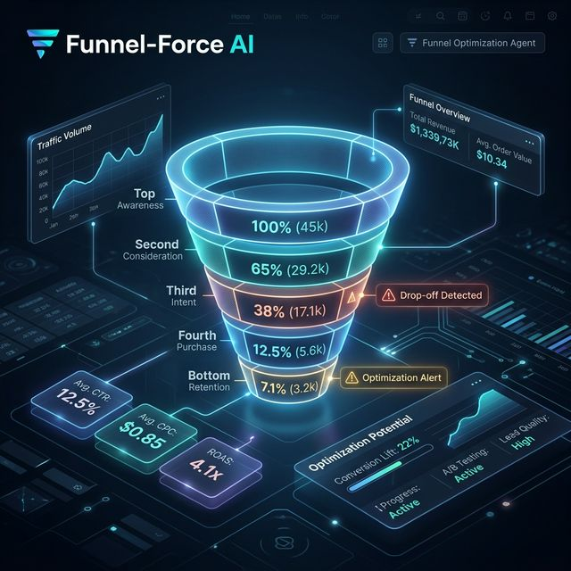

# ⚡ Funnel-Force AI (Funnel Optimization Agent)

Perform professional, behavioral diagnostics on your conversion funnels and architect high-impact growth strategies.



## 🚀 Overview
**Funnel-Force AI v4.0** is an advanced funnel diagnostic engine designed for growth marketers and ops teams. It doesn't just calculate conversion rates; it identifies the **psychological friction** at each stage and provides a prioritized roadmap for optimization.

## ⚡ Key Features
- **Behavioral Diagnostics**: Leverages neural intelligence to diagnose WHY users are dropping off (e.g., "Decision Fatigue", "Trust Gaps").
- **Dynamic Funnel Visualization**: Interactive, real-time funnel charts powered by Plotly in the dashboard.
- **Micro-Segment Analysis**: Tailors insights based on the specific traffic segment (Organic, Paid, Social).
- **Multi-Provider Architecture**: Native support for selecting your AI "Brain" (OpenAI, Gemini, Claude, DeepSeek, or Groq) in the sidebar.
- **Conversion Efficiency Mapping**: Automatic calculation of stage-to-stage drop-offs and overall efficiency.

## 🛠️ Tech Stack
- **Frontend**: Streamlit (Glassmorphism & Interactive Charts)
- **Visualization**: Plotly Graph Objects
- **Intelligence**: LiteLLM (Multi-model support)
- **Data Protocols**: JSON for audits, TXT for strategy briefs.

## 📂 Structure
- `agent.py`: Core diagnostic engine and multi-provider CLI wrapper.
- `app.py`: Premium Streamlit dashboard with visualization.
- `input.txt`: Default funnel metrics for batch analysis.
- `requirements.txt`: Project dependencies.

## 🚀 Quick Launch

### 1. CLI Usage
```bash
python agent.py
```

### 2. Dashboard Usage
```bash
streamlit run app.py
```

## 📊 Strategic Output
The agent outputs a structured JSON analysis including:
- **Drop-off Stage**: Stage-specific leakage metrics.
- **Psychological Reason**: The behavioral "Why".
- **Counter-Bias**: Specific psychological biases to leverage for optimization (e.g., Social Proof, Reciprocity).

---
*Part of the [Real-world-AI-agents-hub](https://github.com/HarshChoudhary2003/Real-world-AI-agents-hub)*
