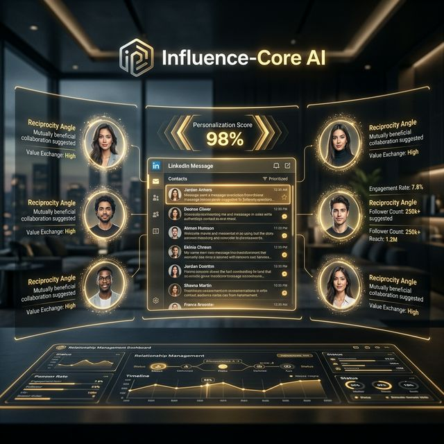

# 🤝 Influence-Core AI (Influencer Outreach Agent)

Architect highly personalized, relationship-first outreach strategies for high-impact influencers with real-time platform previews.



## 🚀 Overview
**Influence-Core AI v2.0** is an advanced relationship management engine designed for PR, Marketing, and Growth teams. It moves beyond generic templates, using neural intelligence to identify unique **personalization anchors** and **reciprocal value propositions** that increase response rates by up to 40%.

## ⚡ Key Features
- **Social Inbox Previews**: Visualizes exactly how your message will look on LinkedIn or Direct Messaging platforms.
- **Value-First Reciprocity Engine**: Automatically identifies the "What's in it for them" for every outreach variant.
- **Multi-Variant Generation**: Provides full professional drafts alongside concise, punchy versions for chat-based platforms.
- **Provider-First Selection**: Native support for selecting your AI brain (OpenAI, Gemini, Claude, DeepSeek, or Groq).
- **Behavioral Follow-up Logic**: Recommends the optimal timing and strategy for follow-ups based on the platform.

## 🛠️ Tech Stack
- **Frontend**: Streamlit (Animated Glassmorphism UI)
- **Intelligence**: LiteLLM (Multi-model support)
- **Data Protocols**: JSON for outreach logic, TXT for draft export.

## 📂 Structure
- `agent.py`: Core outreach engine and multi-provider CLI wrapper.
- `app.py`: Premium animated Streamlit dashboard.
- `input.txt`: Default campaign and influencer context for testing.
- `requirements.txt`: Project dependencies.

## 🚀 Quick Launch

### 1. CLI Usage
```bash
python agent.py
```

### 2. Dashboard Usage
```bash
streamlit run app.py
```

## 📊 Strategic Output
The agent outputs a structured JSON analysis including:
- **Variant Messages**: Multi-length options for different platforms.
- **Personalization Anchors**: Specific hooks to use for authenticity.
- **Psychological Anchors**: Tactical biases utilized (e.g., Social Proof, Reciprocity).

---
*Part of the [Real-world-AI-agents-hub](https://github.com/HarshChoudhary2003/Real-world-AI-agents-hub)*
