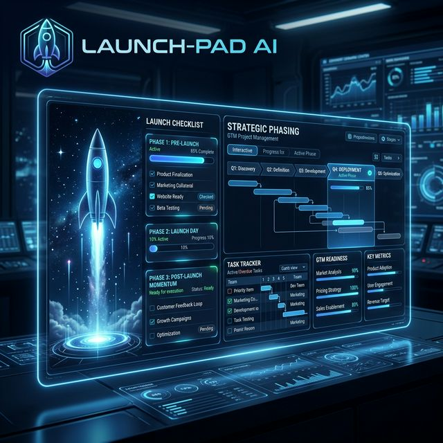

# 🚀 Launch-Pad AI (Product Launch Checklist)

Architect comprehensive, high-stakes product launch checklists that ensure zero-day failure and maximum market impact with real-time interactive tracking.



## 🚀 Overview
**Launch-Pad AI v2.0** is an advanced GTM (Go-To-Market) strategy and operational readiness engine. It moves beyond simple checklists, using neural intelligence to categorize tasks into critical phases, identify channel-specific requirements, and mitigate launch-day risks before they occur.

## ⚡ Key Features
- **Interactive Phase Tracking**: Check off tasks as you go in the dashboard to track your team's readiness.
- **Phased GTM Architecture**: Automatically organizes your launch into Pre-Launch (Warm-up), Launch Day (Execution), and Post-Launch (Momentum).
- **Channel-Specific Focus**: Generates tailored tasks for each communication channel (Website, Email, Social Media).
- **Multi-Provider Architecture**: Choose your preferred "Brain" from OpenAI, Gemini, Claude, DeepSeek, or Groq.
- **Risk Mitigation Guardrails**: Identifies potential launch-day blockers and suggests tactical ways to avoid them.

## 🛠️ Tech Stack
- **Frontend**: Streamlit (Premium Creative UI)
- **Intelligence**: LiteLLM (Multi-model support)
- **Data Protocols**: JSON for GTM logic, TXT for summary export.

## 📂 Structure
- `agent.py`: Core GTM engine and multi-provider CLI wrapper.
- `app.py`: Premium creative Streamlit dashboard with interactive checklists.
- `input.txt`: Default launch context and objectives for testing.
- `requirements.txt`: Project dependencies.

## 🚀 Quick Launch

### 1. CLI Usage
```bash
python agent.py
```

### 2. Dashboard Usage
```bash
streamlit run app.py
```

## 📊 Strategic Output
The agent outputs a structured JSON analysis including:
- **Launch Identity**: A strategic codename and core value hook.
- **Execution Phases**: Detailed chronological tasks with ownership roles.
- **Internal Alignment**: Cross-functional tasks for Sales and Support readiness.

---
*Part of the [Real-world-AI-agents-hub](https://github.com/HarshChoudhary2003/Real-world-AI-agents-hub)*
