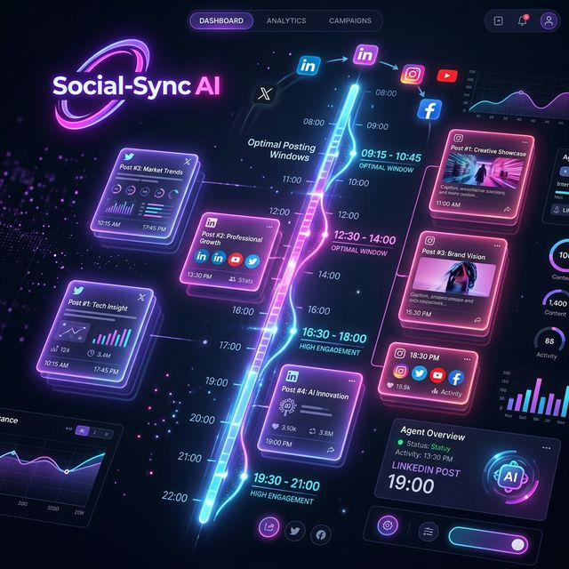

# 📅 Social-Sync AI (Social Media Scheduling)

Architect high-impact, platform-optimized posting schedules that maximize reach and engagement with multi-model intelligence.



## 🚀 Overview
**Social-Sync AI v2.0** is an advanced content orchestration engine designed for digital marketing teams. It moves beyond simple post timing, using neural intelligence to understand **platform nuplexity**, suggest **engagement hooks**, and optimize for **prime-time windows** across professional and social networks.

## ⚡ Key Features
- **Multi-Platform Timeline**: Visualizes your weekly or monthly posting schedule with platform-specific branding.
- **Strategic Content Hooks**: Generates draft hooks for each post based on the campaign objective.
- **Prime-Time Optimization**: Automatically suggests posting times based on target audience timezones and engagement data.
- **Multi-Provider Architecture**: Choose your preferred "Brain" from OpenAI, Gemini, Claude, DeepSeek, or Groq.
- **Visual Asset Strategy**: Recommends the specific type of image or video content needed for each post to maximize the algorithm's favor.

## 🛠️ Tech Stack
- **Frontend**: Streamlit (Premium Creative UI with Slide-up Animations)
- **Intelligence**: LiteLLM (Multi-model support)
- **Data Protocols**: JSON for schedule logic, TXT for draft summary export.

## 📂 Structure
- `agent.py`: Core scheduling engine and multi-provider CLI wrapper.
- `app.py`: Premium animated Streamlit dashboard.
- `input.txt`: Default scheduling context for testing.
- `requirements.txt`: Project dependencies.

## 🚀 Quick Launch

### 1. CLI Usage
```bash
python agent.py
```

### 2. Dashboard Usage
```bash
streamlit run app.py
```

## 📊 Strategic Output
The agent outputs a structured JSON analysis including:
- **Project Identity**: Campaign name and primary GTM goal.
- **Scheduled Postings**: Day-by-day breakdown with platform, time, and strategic rationale.
- **Meta-Data**: Suggested hashtags and cross-platform best practices.

---
*Part of the [Real-world-AI-agents-hub](https://github.com/HarshChoudhary2003/Real-world-AI-agents-hub)*
