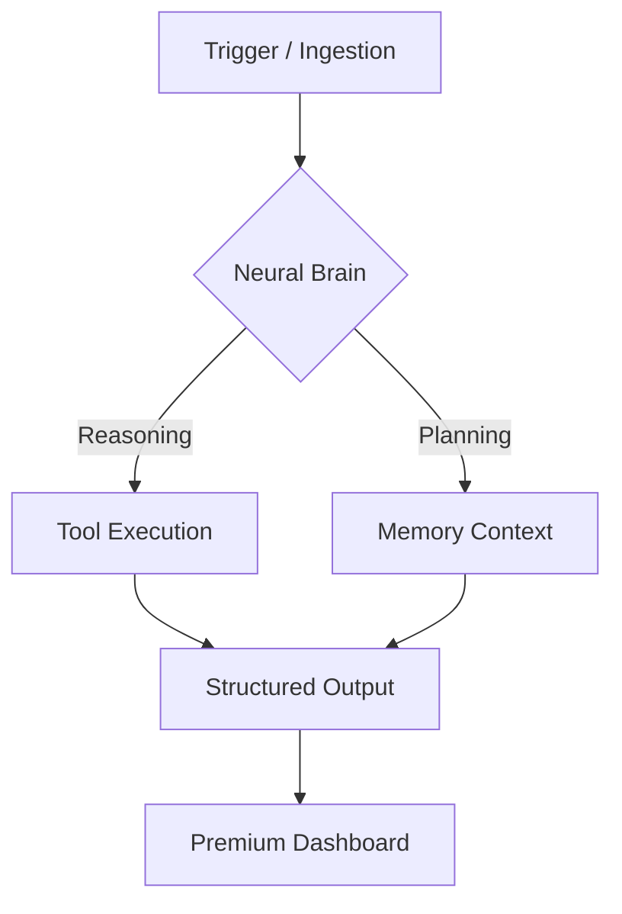

<div align="center">
  

<br>

<!-- Typing Dynamic -->


<br>

<!-- Premium Badge Stack -->
[](https://github.com/HarshChoudhary2003/Real-world-AI-agents-hub)
[](https://github.com/HarshChoudhary2003/Real-world-AI-agents-hub)
[](https://github.com/HarshChoudhary2003/Real-world-AI-agents-hub/stargazers)
[](./LICENSE)

<p align="center">
  <strong>Build. Deploy. Scale. The ultimate operating system for the AI-native enterprise.</strong>
</p>

<p align="center">
  <kbd><b><a href="#-the-agent-ecosystem">Explore Agents →</a></b></kbd>
  <kbd><b><a href="#-quick-start">Deploy in 30s →</a></b></kbd>
  <kbd><b><a href="#-contributing">Join the Alliance →</a></b></kbd>
</p>

</div>

---

## 🧬 The Vision: The Autonomous Age

> *"Software used to be a tool. Now, software is the worker."*

The industry has evolved beyond "AI as a feature." We are entering the era of the **Agentic Enterprise**—where autonomous intelligence layers manage complex systems, analyze deep data, and execute cross-functional workflows with zero human friction.

**Real-world-AI-agents-hub** is not just a repository; it is a **Category-Defining Platform Blueprint**. We bridge the gap between "LLM Demos" and "Production Workflows." 

This is the largest registry of **specialized, production-hardened AI agents** designed to be the backbone of your next unicorn.

---

## 💎 Why This Wins

- **System > Scripts:** Every agent is part of a unified, modular architecture.
- **Platform > Repo:** Built for deployment, not just educational reading.
- **Real-world > Demo:** Every directory solves a critical business or personal pain point.

---

## 🔥 Strategic Feature Stack

| Feature | Engineering Depth |
| :--- | :--- |
| **🚀 Production Polish** | Every agent features a custom-engineered "SaaS-Elite" UI via Streamlit. |
| **🧠 Multi-Agent Core** | Native support for CrewAI and LangChain orchestration. |
| **🔌 Provider Agnostic** | Hot-swappable intelligence (GPT-4o, Claude 3.5, Gemini 1.5, Llama 3). |
| **🏗️ Infinite Scaling** | Modular structure allows for building anything from a simple bot to a swarm. |

---

## 🌍 The Agent Ecosystem (76+ Specialized Systems)

*Click on any agent to access its specialized core and dashboard.*

### 💼 Business Operations Systems
*Enterprise-grade automation for high-impact cross-functional logic.*
- [🧬 **DataForge AI**](./Business%20Operations%20Agents/CRM%20data%20enrichment%20agent) – Intelligence-led CRM enrichment & decision mapping.
- [📄 **InvoiceIntel**](./Business%20Operations%20Agents/Invoice%20processing%20agent) – Multi-model Vision layer for financial document extraction.
- [🎯 **LeadScore AI**](./Business%20Operations%20Agents/Lead%20qualification%20agent) – Precision lead qualification via BANT/CHAMP frameworks.
- [🤝 **SalesFollowAI**](./Business%20Operations%20Agents/Sales%20follow-up%20agent) – High-conversion post-interaction narrative generator.
- [🛡️ **SupportCraft**](./Business%20Operations%20Agents/Customer%20support%20response%20agent) – Empathetic response intelligence & sentiment auditing.
- [💸 **ExpenseIQ**](./Business%20Operations%20Agents/Expense%20categorization%20agent) – Algorithmic category detection & anomaly audit.
- [📋 **SOPFlow AI**](./Business%20Operations%20Agents/Internal%20SOP%20generator%20agent) – Standardized Ops Architect for scaling procedures.
- [💹 **InsightCore**](./Business%20Operations%20Agents/KPI%20dashboard%20insight%20agent) – Strategic KPI narrative & causality diagnostic.
- [📑 **ClauseClear**](./Business%20Operations%20Agents/Contract%20clause%20explanation%20agent) – Advanced legal plain-language engine & risk auditor.
- [⚖️ **VendorFlow AI**](./Business%20Operations%20Agents/Vendor%20comparison%20agent) – Strategic vendor comparative analysis grid.

### 🧪 Marketing & Growth Systems
*Performance-driven intelligence for scale and buyer persona mapping.*
- [🎨 **AdForge AI**](./Marketing%20&%20Growth%20Agents/Ad%20copy%20generator%20agent) – Growth-studio with persona simulation logic.
- [📈 **AdIntel AI**](./Marketing%20&%20Growth%20Agents/Campaign%20performance%20analysis%20agent) – Budget utility auditor & leaky bucket detector.
- [🧪 **OptiTest AI**](./Marketing%20&%20Growth%20Agents/A%20B%20test%20suggestion%20agent) – Strategic A/B test architect with ICE scoring.
- [🛡️ **Persona-Forge**](./Marketing%20&%20Growth%20Agents/Customer%20persona%20builder%20agent) – Market data synthesis & customer architect.
- [⚡ **Funnel-Force**](./Marketing%20&%20Growth%20Agents/Funnel%20optimization%20agent) – Performance diagnostic & conversion strategy.
- [📩 **Email-Mind**](./Marketing%20&%20Growth%20Agents/Email%20marketing%20agent) – High-conversion multi-model copywriting.
- [🤝 **Influence-Core**](./Marketing%20&%20Growth%20Agents/Influencer%20outreach%20agent) – Relationship-first influencer outreach engine.
- [🚀 **Launch-Pad AI**](./Marketing%20&%20Growth%20Agents/Product%20launch%20checklist%20agent) – GTM operational readiness & launch architecture.
- [📅 **Social-Sync**](./Marketing%20&%20Growth%20Agents/Social%20media%20scheduling%20agent) – Cross-platform orchestration & scheduling.
- [🎭 **Voice-Verify**](./Marketing%20&%20Growth%20Agents/Brand%20voice%20consistency%20agent) – Brand voice & linguistic integrity audit.

### 📊 Data & Automation Systems
*Mission-critical intelligence for pipeline integrity and forensic auditing.*
- [🧬 **NeuralData AI**](./Data%20&%20Automation%20Agents/CSV%20data%20cleaning%20agent) – Multi-cloud batch CSV cleaning & integrity auditing.
- [🔢 **Sheet-Logic AI**](./Data%20&%20Automation%20Agents/Spreadsheet%20formula%20generator%20agent) – Multinational spreadsheet formula & logic architect.
- [🛡️ **Data-Guard AI**](./Data%20&%20Automation%20Agents/Data%20validation%20agent) – Neural dataset integrity & schema governance.
- [🔌 **API-Insight**](./Data%20&%20Automation%20Agents/API%20response%20interpreter%20agent) – Neural API response forensic & interpreter.
- [🛡️ **Log-Sentinel**](./Data%20&%20Automation%20Agents/Log%20anomaly%20detection%20agent) – System telemetry forensic & anomaly detection.
- [🎼 **Orchestra-Core**](./Data%20&%20Automation%20Agents/Workflow%20orchestration%20agent) – Multi-step execution architecture for complex missions.
- [💾 **Pipeline-Forge**](./Data%20&%20Automation%20Agents/ETL%20pipeline%20design%20agent) – High-performance ETL & cloud data architect.
- [🚑 **Error-Forensics**](./Data%20&%20Automation%20Agents/Error%20classification%20agent) – SRE incident diagnosis & error classification.
- [📊 **Alert-Insight**](./Data%20&%20Automation%20Agents/Monitoring%20alert%20explanation%20agent) – Monitoring alert translation & root-cause diagnostic.
- [🏗️ **Auto-Strategist**](./Data%20&%20Automation%20Agents/Automation%20recommendation%20agent) – Process mining & high-ROI automation strategist.

### 🧠 Personal Productivity Systems
*A 10-agent neural architecture designed for elite operational focus.*
- [🧠 **PriorityBrain**](./Personal%20Productivity%20Agents/daily-priority-agent) – NLP task ingestion & algorithmic urgency sorting.
- [🗄️ **BrainVault**](./Personal%20Productivity%20Agents/Personal%20knowledge%20base%20agent) – Local RAG knowledge base via vector space.
- [⚡ **ActionForge**](./Personal%20Productivity%20Agents/Note-to-action%20item%20agent) – Unstructured text-to-task neural extraction.
- [📧 **MailMind AI**](./Personal%20Productivity%20Agents/Email%20summarization%20agent) – Intelligent thread logic & summary mapping.
- [📅 **SyncGuard**](./Personal%20Productivity%20Agents/Calendar%20conflict%20resolver%20agent) – Conflict detection & resolution engine.
- [📋 **AgendaCraft**](./Personal%20Productivity%20Agents/Meeting%20agenda%20generator%20agent) – High-fidelity meeting timeline architect.
- [🧘 **Reflect AI**](./Personal%20Productivity%20Agents/Daily%20goal%20reflection%20agent) – Algorithmic daily target analytics.
- [🔔 **PingCraft**](./Personal%20Productivity%20Agents/Smart%20reminder%20agent) – Distributed deadline alerting engine.
- [⏳ **ChronoBlock**](./Personal%20Productivity%20Agents/Time-blocking%20planner%20agent) – Continuous task packing logic planner.
- [🔥 **StreakForge**](./Personal%20Productivity%20Agents/Habit%20tracking%20agent) – Persistence density metrics & habit tracking.

### 🔬 Research & Analysis Systems
*Scientific intelligence for synthesizing complex information signals.*
- [🔬 **SWOT Horizon**](./Research%20&%20Analysis%20Agents/SWOT%20analysis%20agent) – TOWS matrix & strategic opportunity analysis.
- [🌐 **Web Research**](./Research%20&%20Analysis%20Agents/Web%20research%20agent) – Autonomous multi-model executive research.
- [🎬 **StreamBrief**](./Research%20&%20Analysis%20Agents/YouTube%20video%20summary%20agent) – Neural video transcript distiller & insight mapper.
- [💰 **CapitalMind**](./Research%20&%20Analysis%20Agents/Investment%20thesis%20generator%20agent) – Evidence-driven investment thesis architect.
- [💹 **TrendSynthetix**](./Research%20&%20Analysis%20Agents/Market%20trend%20summarization) – Market context trend deconstruction.
- [📰 **NewsFlow**](./Research%20&%20Analysis%20Agents/News%20aggregation%20agent) – Global thematic news intelligence digests.
- [⚖️ **PolicyGuard**](./Research%20&%20Analysis%20Agents/Policy%20document%20summarizer%20agent) – Thematic synthesis for regulatory frameworks.

### ✍️ Writing & Content Systems
*Creative engines for high-impact professional narrative generation.*
- [📝 **Blog Architect**](./Writing%20&%20Content%20Agents/Blog%20post%20generator%20agent) – SEO-optimized post pipeline.
- [💼 **CoverCraft**](./Writing%20&%20Content%20Agents/Cover%20letter%20writing%20agent) – Job-specific tailored cover letter architect.
- [💬 **AI FAQ Gen**](./Writing%20&%20Content%20Agents/FAQ%20generation%20agent) – Credentialed FAQ generator.
- [✨ **GrammarPlus**](./Writing%20&%20Content%20Agents/Grammar%20correction%20agent) – Semantic deep-edit & tone correction.
- [🔗 **HookGen Pro**](./Writing%20&%20Content%20Agents/LinkedIn%20post%20ideation%20agent) – LinkedIn post & hook ideation studio.
- [🛍️ **ProductCopy**](./Writing%20&%20Content%20Agents/Product%20description%20agent) – Outcome-driven product descriptions.
- [📄 **ResumeAI**](./Writing%20&%20Content%20Agents/Resume%20optimization%20agent) – ATS-optimized enhancement engine.
- [🔎 **SEOClusters**](./Writing%20&%20Content%20Agents/SEO%20keyword%20expansion%20agent) – Predictive keyword expansion clusters.
- [📽️ **SlideForge AI**](./Writing%20&%20Content%20Agents/Script-to-slide%20outline%20agent) – Script-to-slide visual architect.
- [🎭 **ToneWizard**](./Writing%20&%20Content%20Agents/Tone%20rewriting%20agent) – Multi-persona voice rewriter.

### 🛠️ AI & Engineering Systems
*Advanced tooling for neural architecture evaluation and model benchmarking.*
- [🧠 **ModelMind AI**](./AI%20%20&%20Engineering%20Agents/Model%20comparison%20agent) – Deep architectural trade-off analysis.
- [✨ **PromptForge AI**](./Data%20&%20Automation%20Agents/Prompt%20optimization%20agent) – Neural prompt engineering & linguistic structure optimization.
- [🔍 **SemanticForge AI**](./AI%20%20&%20Engineering%20Agents/RAG%20document%20retrieval%20agent) – Orchestrated RAG document & contextual semantic retrieval.
- [⚡ **ToolForge AI**](./AI%20%20&%20Engineering%20Agents/Tool-calling%20agent) – Autonomous tool-call orchestration with multi-tool execution registry.
- [🧩 **ThinkForge AI**](./AI%20%20&%20Engineering%20Agents/Multi-step%20reasoning%20agent) – Structured multi-step decomposition & chain-of-thought reasoning engine.
- [🛠️ **CleanCode AI**](./AI%20%20&%20Engineering%20Agents/Code%20refactoring%20agent) – Advanced syntax architectural transformation & best practice adherence refactoring engine.
- [🐛 **BugSentinel AI**](./AI%20%20&%20Engineering%20Agents/Bug%20explanation%20agent) – Neural traceback analysis & root cause diagnostic forensics.
- [📖 **DocForge AI**](./AI%20%20&%20Engineering%20Agents/API%20documentation%20agent) – Automated deterministic REST API schema documentation & contract logic compiler.
- [🧪 **TestForge AI**](./AI%20%20&%20Engineering%20Agents/Test%20case%20generation%20agent) – Rigorous test suite & edge case regression validation framework.
- [🏗️ **ArchForge AI**](./AI%20%20&%20Engineering%20Agents/System%20architecture%20explainer%20agent) – Topological data-flow extraction & implicitly derived trade-off analytical engine.

### 🗄️ HR, Legal & Compliance Systems
*Deterministic talent acquisition and operational risk frameworks.*
- [💼 **TalentForge AI**](./HR%20,%20Legal%20&%20Compliance%20Agents/Job%20description%20generator%20agent) – Inclusive requisition & job description intelligence pipeline.
- [🔎 **ScreenGenius Pro AI**](./HR%20,%20Legal%20&%20Compliance%20Agents/Candidate%20screening%20agent) – Multi-axis algorithmic candidate screening matrix with red-flag detection & custom interview probes.
- [🎙️ **QuestForge AI**](./HR%20,%20Legal%20&%20Compliance%20Agents/Interview%20question%20generator%20agent) – Autonomous technical interview question architect.
- [📈 **ReviewForge AI**](./HR%20,%20Legal%20&%20Compliance%20Agents/Performance%20review%20agent) – Professional tone synthesis and constructive performance appraisal engine.
- [⚖️ **ComplianceGuard AI**](./HR%20,%20Legal%20&%20Compliance%20Agents/Policy%20compliance%20checker%20agent) – Automated enterprise policy enforcement & liability prevention matrix.
- [⚠️ **RiskForge AI**](./HR%20,%20Legal%20&%20Compliance%20Agents/Risk%20assessment%20agent) – Threat modeling architecture resolving operational and deployment liabilities conditionally.
- [🛡️ **BriefForge AI**](./HR%20,%20Legal%20&%20Compliance%20Agents/Legal%20clause%20summarization%20agent) – Legal clause syntactic translation mechanism into executive language logic.
- [🔐 **PrivacyForge AI**](./HR%20,%20Legal%20&%20Compliance%20Agents/Data%20privacy%20explanation%20agent) – Contextual data privacy regulation compliance matrix mapping features to legal bounds.

---

## 🏗️ Architecture: The Agentic Core

We don't just write scripts. We build **Autonomous Entities** that follow a strict industrial design pattern.



---

## 🧪 Featured Agents (The Precision Squad)

| Agent | Core Intelligence | Status | Tech Vector |
| :--- | :--- | :--- | :--- |
| **PriorityBrain** | Urgency-Sorting Logic | ✅ Operational | Python • NLP |
| **InvoiceIntel** | Neural Vision Mapping | 💎 Enterprise | Vision • LiteLLM |
| **AdForge AI** | Growth Model Swarms | 🔥 Advanced | CrewAI • OpenAI |
| **NeuralData** | Batch integrity auditing | 🚑 Production | Pandas • AI |

---

## ⚙️ Tech Stack & Governance

- **Intelligence Layer:** GPT-4o, Claude 3.5 Sonnet, Gemini 1.5 Pro, Llama 3.
- **Agent Framework:** CrewAI, LangChain, LiteLLM.
- **Frontend Stack:** Streamlit (Custom Glassmorphism CSS), Plotly.
- **Data Engineering:** Pandas, VectorDB (Pinecone/Chroma).

---

## 🚀 Quick Start (Deploy in < 180s)

### 1. Initialize Runtime
```bash
git clone https://github.com/HarshChoudhary2003/Real-world-AI-agents-hub.git
cd Real-world-AI-agents-hub
python -m venv venv && source venv/bin/activate # Windows: .\venv\Scripts\activate
pip install -r requirements.txt
```

### 2. Configure Credentials
```bash
cp .env.example .env # Add your OPENAI_API_KEY, ANTHROPIC_API_KEY, etc.
```

### 3. Launch the Master Brain
```bash
cd "Personal Productivity Agents"
streamlit run Master_Dashboard.py
```

---

## 📸 Visual Documentation

<div align="center">
  <table width="100%">
    <tr>
      <td width="50%">
        
        <p align="center"><i>Fig 1.0: Real-time Neural Analytics Dashboard</i></p>
      </td>
      <td width="50%">
        
        <p align="center"><i>Fig 2.0: Autonomous Multi-Agent Coordination</i></p>
      </td>
    </tr>
  </table>
</div>

---

## 🤝 Join the Alliance (Contributing)

We are building a global collective of the top 0.1% AI engineers. 

1. **Review** our [CONTRIBUTING.md](./CONTRIBUTING.md) for UI/UX standards.
2. **Claim** an issue or propose a new "Specialized System."
3. **Draft** your PR with a high-fidelity GIF of the dashboard.

---

## 🌟 Visionary Roadmap

- [x] **v1.0** - Foundation: Personal Productivity Suite (10 Agents)
- [x] **v2.0** - Expansion: Writing, Research & Growth Suites (30 Agents)
- [ ] **v3.0** - **Enterprise Ops & Engineering (Active: 60 Agents)**
- [ ] **v4.0** - Intelligence benchmarks & Agent Marketplace
- [ ] **v5.0** - The Multi-Agent Swarm Colony (100+ Agents)

---

## 🔊 Signal to Action

**Don't just watch the future. Build it.**

- ⭐ **Stargate the repo:** Support the mission.
- 🍴 **Fork the Core:** Start your agentic journey.
- 📢 **Share the Signal:** Tell the world about the future of work.

<div align="center">
  <br>
  
  <br>
  <p>Architected with ❤️ by <a href="https://github.com/HarshChoudhary2003">Harsh Choudhary</a></p>
  <p><i>The OS for the Autonomous Age.</i></p>
</div>
