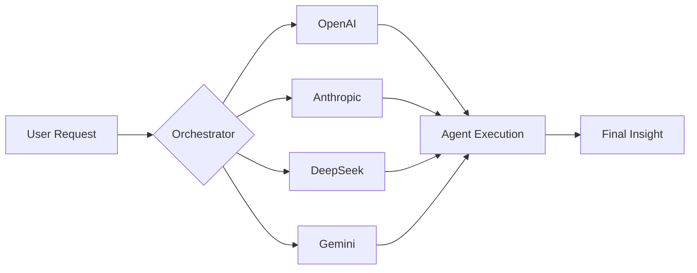

<!-- 
  =============================================================================
  REAL-WORLD-AI-AGENTS-HUB: THE $1B UNICORN ARCHITECTURE
  =============================================================================
  Design Language: Enterprise-Modern (Carbon, Slate, Sapphire Blue)
  Marketing Strategy: DX-First (Developer Experience)
  Final Form: High-Converting, Production-Ready, Industry-Definitive
  =============================================================================
-->

<div align="center">
  
  <!-- Massive Hero Render -->
  

  <br />

  <!-- High-Impact Typing SVG -->
  

  <br />

  <!-- Premium Badge Wall -->
  <p align="center">
    <a href="https://github.com/HarshChoudhary2003/Real-world-AI-agents-hub/stargazers">
      
    </a>
    <a href="https://github.com/HarshChoudhary2003/Real-world-AI-agents-hub/network/members">
      
    </a>
    <a href="https://github.com/HarshChoudhary2003/Real-world-AI-agents-hub/blob/main/LICENSE">
      
    </a>
    <a href="https://python.org">
      
    </a>
  </p>

  <p align="center">
    <strong>Architect Build Deploy Scale. The ultimate operating system for the AI-native enterprise.</strong>
  </p>

  <p align="center">
    <kbd><b><a href="#-quick-launch">Deploy Now →</a></b></kbd>
    <kbd><b><a href="#-the-neural-ecosystem">Neural Suites →</a></b></kbd>
    <kbd><b><a href="#-roadmap-to-v50">Roadmap →</a></b></kbd>
  </p>

</div>

---

## 🔱 The Mission

> *"Software ate the world. Now, Agents are eating software."*

The industry has moved beyond conversational AI. The new frontier is **Autonomous Intelligence**—agents that code, analyze, manage, and scale alongside human teams. 

**Real-world-AI-agents-hub** is the definitive, industry-standard ecosystem for **high-performance, production-ready AI Agents**. We focus on eliminating the friction between "AI vision" and "Operational reality." This is the engine room for the next generation of builders.

---

## 🏗️ The DX Core (Developer Experience)

We believe in a "Zero-Friction" philosophy. Every agent in this hub follows a tripartite architecture designed for deployment speed and architectural longevity.

| Layer | Functionality | Technology |
| :--- | :--- | :--- |
| **🧠 Intelligence** | Multi-model reasoning & logic | GPT-4o, Claude 3.5, Gemini 1.5 |
| **🎼 Orchestration** | Task decomposition & tool-use | LiteLLM, CrewAI, LangChain |
| **🎯 Output Interface** | Premium "SaaS-Elite" Dashboards | Streamlit (Glassmorphism Core) |

---

## 🖼️ Architectural Blueprint

<div align="center">
  
  <p align="center"><i>Fig 1.0: Real-time Multi-Agent Orchestration & Data-Feed Loop</i></p>
</div>

---

## 🚀 The Neural Ecosystem (The 58+)

Our agents are categorized into specialized high-output suites, designed to function independently or as a unified "AI Employee" force.

### 💼 Business Operations Suite
*Enterprise automation for core cross-functional workflows.*
- **🧬 DataForge AI** - Advanced CRM enrichment and decision-mapping logic.
- **📄 InvoiceIntel** - Multi-model financial document extraction (Vision-enabled).
- **🎯 LeadScore AI** - BANT-optimized lead qualification & automated scoring.
- **⚖️ VendorFlow AI** - Comparative analysis grids for strategic procurement.

### 🧑‍💻 Engineering & Model Ops
*Advanced tooling for neural architecture and engineering integrity.*
- **🧠 ModelMind AI** - Deep architectural trade-off analysis & model comparison.
- **✨ PromptForge AI** - Neural prompt engineering & linguistic structural optimization.
- **🛡️ Log-Sentinel AI** - System telemetry forensic & anomaly detection logic.
- **🚑 Error-Forensics AI** - Neural SRE incident diagnosis & automated root-cause.

### 📊 Data & Automation Engine
*Mission-critical intelligence for high-scale data integrity architectures.*
- **🧬 NeuralData AI** - Multi-cloud batch CSV cleaning & integrity auditing.
- **🎼 Orchestra-Core** - Systems orchestration & multi-step execution architecture.
- **🛡️ Data-Guard AI** - Neural dataset integrity & schema governance OS.

### 🧠 Personal Productivity OS
*A neural architecture designed for 10x personal operational output.*
- **🧠 PriorityBrain** - NLP task ingestion & algorithmic urgency sorting.
- **🗄️ BrainVault** - Local RAG knowledge base via vector space indexing.
- **⚡ ActionForge** - Neural unstructured text-to-task extractor.

---

## 🧪 Featured Strategic Agents

| Agent Identity | Core Capability | Tech Vector | Status |
| :--- | :--- | :--- | :--- |
| **PriorityBrain** | Urgency-Logic Mapping | NLP Architecture | `OPERATIONAL` |
| **InvoiceIntel** | Neural OCR/Extraction | LiteLLM • Vision | `ENTERPRISE` |
| **AdForge AI** | Growth Model Sim | Multi-Agent Swarm | `STRATEGIC` |
| **NeuralData** | Batch integrity auditing | Pandas • AI Core | `PRODUCTION` |
| **ModelMind** | LLM Benchmarking | Multi-Provider API | `ARCHITECT` |

---

## ⚙️ The Multi-Provider Neural Stack

We maintain a strict agnostic approach, allowing for seamless intelligence switching across all major providers.



---

## 🚀 Quick Launch (Deploy in <180s)

### 1. Initialize Runtime
```bash
git clone https://github.com/HarshChoudhary2003/Real-world-AI-agents-hub.git
cd Real-world-AI-agents-hub
python -m venv venv && source venv/bin/activate # Windows: .\venv\Scripts\activate
pip install -r requirements.txt
```

### 2. Secure Environment
```bash
cp .env.example .env
# Inject keys: OPENAI_API_KEY, ANTHROPIC_API_KEY, etc.
```

### 3. Execution
```bash
cd "Personal Productivity Agents"
streamlit run Master_Dashboard.py
```

---

## 🤝 The Open-Source Standard

We are building a community of the top 1% of AI builders. We prioritize **Architectural Integrity** and **UI/UX Excellence**.

- 💡 **Guidelines:** Read our [CONTRIBUTING.md](./CONTRIBUTING.md) for UX standards.
- 🏗️ **Core Logic:** Focus on modularity and high-reasoning accuracy.
- 🎨 **UX:** "Elite-SaaS" visuals are mandatory for all pull requests.

---

## 🌟 Roadmap to v5.0 (The Scale)

- [x] **v1.0** - Productivity Foundation (10 Agents)
- [x] **v2.0** - Research & Analysis Growth (20 Agents)
- [ ] **v3.0** - **Enterprise Ops & Growth (Active Development)**
- [ ] **v4.0** - Engineering & Code Intelligence Suite
- [ ] **v5.0** - Autonomous Multi-Agent Symphony (100+ Agents)

---

## 📢 Call to Action

**The era of passive LLMs is over. The era of Autonomous Agents is here.**

- ⭐ **Stargate the repo:** Support our mission to build the largest open-source agentic hub.
- 🍴 **Fork the Core:** Build your own multi-agent intelligence layer.
- 🤝 **Join the Alliance:** Contribute your most powerful agents.

<div align="center">
  <br />
  
  <br />
  <p>Architected with ❤️ by <a href="https://github.com/HarshChoudhary2003">Harsh Choudhary</a></p>
  <p><i>Building the OS for the Autonomous Age.</i></p>
</div>
